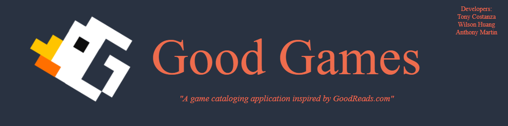

    

# Good Games
      

## ggs---app.herokuapp.com

## About

Good Games is social game cataloging application where users come to share video game themed reviews and articles, engage in light discussions. 

## App Features
### Homepage
Start putting gifs and images here.

## [Wiki Pages](https://github.com/PotatoAim11518/GGs-Full-Stack/wiki)
1. [Feature List](https://github.com/PotatoAim11518/GGs-Full-Stack/wiki/MVP-Feature-List)
2. [User Stories and Acceptance Criteria](https://github.com/PotatoAim11518/GGs-Full-Stack/wiki/User-Stories)
3. [Database Schema](https://github.com/PotatoAim11518/GGs-Full-Stack/wiki/Database-Schema)
4. [API Documentation](https://github.com/PotatoAim11518/GGs-Full-Stack/wiki/API-Documentation)
5. [Frontend Routes](https://github.com/PotatoAim11518/GGs-Full-Stack/wiki/Frontend-Routes)

### Deployment:
* Heroku

### Testing:
* Postman
* Postbird

### Technologies
* JavaScript
* Pug
* Sequelize
* PostgreSQL
* CSS

